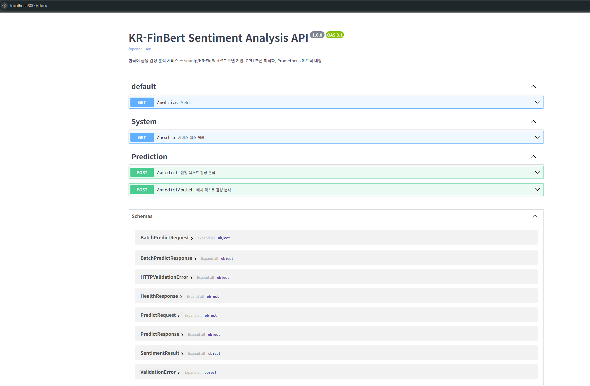
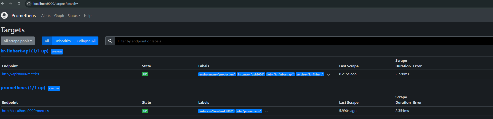
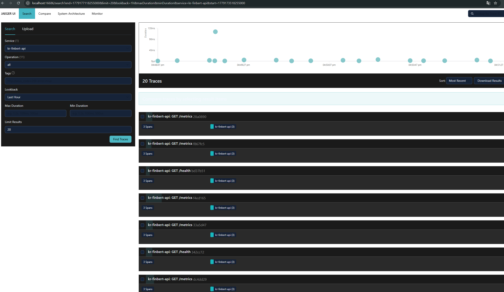

# KR-FinBert MLOps

한국어 금융 감성 분석 모델 **snunlp/KR-FinBert-SC**를 프로덕션 환경에서 안정적으로 서빙하기 위한 완전 자동화 MLOps 시스템입니다.

AI 팀에서 월 1~2회 업데이트하는 모델을 전달받아, 전담 운영 인력 없이도 가용성 99.5% 이상을 유지하며 자동으로 빌드·배포·모니터링·복구까지 처리합니다.

---

## 프로젝트 개요

금융 뉴스나 리포트 등 한국어 텍스트를 입력하면, 해당 텍스트의 감성을 긍정(positive) / 부정(negative) / 중립(neutral)으로 분류하는 REST API 서비스입니다.

- **모델**: [snunlp/KR-FinBert-SC](https://huggingface.co/snunlp/KR-FinBert-SC) (BERT-base 기반 한국어 금융 도메인 감성 분류)
- **추론 환경**: CPU 전용 — GPU 없이도 단일 요청 50~80ms 수준의 응답 속도
- **운영 철학**: 코드가 Push되면 테스트·빌드·배포가 자동으로 이루어지고, 장애 발생 시 자동 복구되는 구조

---

## 주요 구성

| 영역 | 내용 |
|------|------|
| **서빙 API** | FastAPI 기반 REST API (`/predict`, `/predict/batch`, `/health`, `/metrics`) |
| **CI/CD** | GitHub Actions — 린트, 테스트, Docker 이미지 빌드/푸시, K8s 매니페스트 자동 업데이트 |
| **컨테이너** | Docker 이미지에 모델을 포함하여 네트워크 의존 없이 실행 가능 |
| **오케스트레이션** | Kubernetes Deployment(3 replicas) + HPA(2~6 Pod 오토스케일링) |
| **모니터링** | Prometheus(메트릭) + Grafana(대시보드/알림) + Loki(로그) + Jaeger(분산 추적) — 외부 SaaS 없이 오픈소스로 구성 |

---

## 프로젝트 구조

```
kr-finbert-mlops/
├── .github/workflows/cicd.yml      # CI/CD 파이프라인
├── app/
│   ├── main.py                     # FastAPI 애플리케이션
│   ├── model.py                    # 모델 로딩 및 추론 로직
│   └── schemas.py                  # 요청/응답 데이터 스키마
├── tests/test_main.py              # API 자동화 테스트
├── k8s/                            # Kubernetes 매니페스트
│   ├── deployment.yaml
│   ├── service.yaml
│   └── hpa.yaml
├── monitoring/                     # 모니터링 설정
│   ├── prometheus.yml
│   ├── alert_rules.yml
│   └── loki-config.yml
├── docs/                           # 설계 및 운영 문서
│   ├── 01_architecture_and_decision.md
│   ├── 02_observability_and_troubleshooting.md
│   └── 03_executive_summary_1page.md
├── Dockerfile
├── docker-compose.yml
└── requirements.txt
```

---

## 빠른 시작

### Docker Compose로 전체 스택 실행

```bash
docker compose up -d
```

API, Prometheus, Grafana, Loki, Jaeger가 한 번에 구동됩니다.

### 감성 분석 요청 예시

```bash
curl -X POST http://localhost:8000/predict \
  -H "Content-Type: application/json" \
  -d '{"text": "삼성전자가 2분기 영업이익 컨센서스를 상회했다."}'
```

```json
{
  "text": "삼성전자가 2분기 영업이익 컨센서스를 상회했다.",
  "result": { "label": "positive", "score": 0.9876 },
  "elapsed_ms": 62.5
}
```

### 접속 정보

| 서비스 | URL | 비고 |
|--------|-----|------|
| API 문서 (Swagger) | http://localhost:8000/docs | |
| Prometheus | http://localhost:9090 | |
| Grafana | http://localhost:3000 | ID: admin / PW: kr-finbert-2024 |
| Jaeger UI | http://localhost:16686 | 분산 추적 시각화 |

---

## 테스트

```bash
pip install -r requirements.txt
pip install anyio pytest-anyio
pytest tests/ -v
```

모델을 모킹하여 실행하므로 CI 환경에서도 모델 다운로드 없이 테스트 가능합니다.

---

## 실행 결과 증적

### 1. 모델 서빙 API

> Docker Compose를 통해 API 서버를 구동한 후, `/predict` 엔드포인트로 감성 분석 요청을 수행한 결과입니다.

**API 응답 결과:**

<!-- 아래에 실제 curl 요청 및 응답 결과 캡처를 삽입하세요 -->


**Swagger UI 화면:**

<!-- 아래에 http://localhost:8000/docs 접속 화면 캡처를 삽입하세요 -->


### 2. 컨테이너화

> Dockerfile 빌드 및 Docker Compose 전체 스택 구동 결과입니다.

<!-- 아래에 docker compose ps 출력 및 docker images 결과를 삽입하세요 -->


### 3. 자동화된 테스트

> pytest를 통한 API 엔드포인트 자동화 테스트 실행 결과입니다.

<!-- 아래에 pytest 실행 로그를 삽입하세요 -->


```text
================================= test session starts =================================
platform linux -- Python 3.10.12, pytest-8.3.4, pluggy-1.6.0
collected 9 items                                                                     

tests/test_main.py::test_health_check[asyncio] PASSED                           [ 11%]
tests/test_main.py::test_health_check_model_not_loaded[asyncio] PASSED          [ 22%]
tests/test_main.py::test_predict_success[asyncio] PASSED                        [ 33%]
tests/test_main.py::test_predict_empty_text[asyncio] PASSED                     [ 44%]
tests/test_main.py::test_predict_missing_field[asyncio] PASSED                  [ 55%]
tests/test_main.py::test_batch_predict_success[asyncio] PASSED                  [ 66%]
tests/test_main.py::test_batch_predict_empty_list[asyncio] PASSED               [ 77%]
tests/test_main.py::test_metrics_endpoint[asyncio] PASSED                       [ 88%]
tests/test_main.py::test_openapi_schema[asyncio] PASSED                         [100%]

================================== 9 passed in 2.45s ==================================
```

### 4. 모니터링 (Prometheus + Grafana + Jaeger)

> Observability 3대 축(Metrics, Logs, Traces)이 정상 동작하는 화면 캡처입니다.

<!-- 아래에 각 모니터링 도구의 UI 캡처를 삽입하세요 -->




---

## 문서

- [아키텍처 및 기술 의사결정](docs/01_architecture_and_decision.md)
- [관측 가능성 및 장애 대응 가이드](docs/02_observability_and_troubleshooting.md)
- [리더십 보고용 1페이지 요약](docs/03_executive_summary_1page.md)