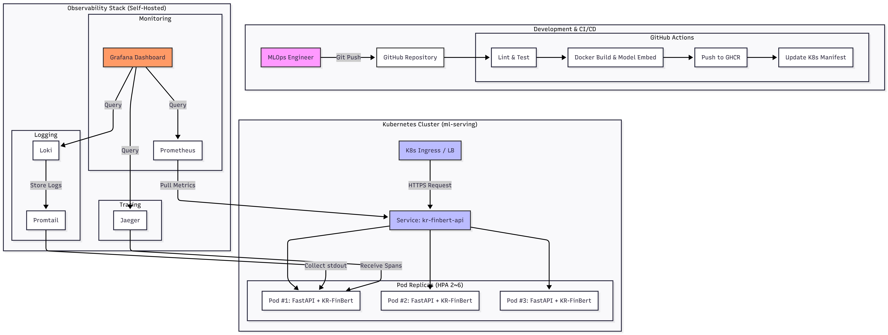
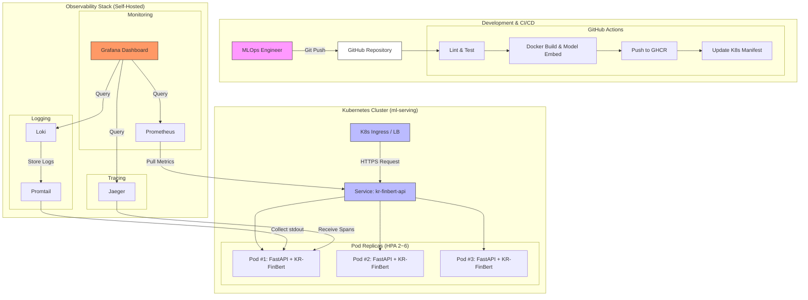

# 시스템 아키텍처 및 의사결정 기록

## 1. 개요

본 문서는 한국어 금융 감성 분석 모델(`snunlp/KR-FinBert-SC`)의 프로덕션 서빙 시스템 아키텍처와 기술 선택 근거를 기록합니다.

### 1.1 프로젝트 목표

| 항목 | 목표 |
|------|------|
| **가용성** | 99.5% 이상 (연간 다운타임 ≤ 43.8시간) |
| **운영 방식** | 전담 운영자 없음, 완전 자동화 |
| **모델 업데이트** | 월 1~2회, CI/CD 자동 배포 |
| **추론 환경** | CPU 전용 (GPU 불필요) |
| **팀 규모** | 개발자 5명 (MLOps 전담 1명) |

### 1.2 전체 아키텍처 설계도





### 1.3 모델 전달 프로세스 및 전제 조건

> **전제**: 본 시스템에서는 인프라 가용 자원의 제약상, AI 팀이 별도의 내부 모델 레지스트리(MLflow, W&B 등)를 운영하지 않는 것으로 가정합니다. 대신, AI 팀이 HuggingFace Hub의 `snunlp/KR-FinBert-SC` 저장소에 새 버전을 릴리스(Push)하는 것을 **모델 전달의 트리거**로 간주합니다.

**이 가정이 타당한 이유:**

1. **인프라 경량화**: 별도 모델 레지스트리 서버(MLflow 등)를 구축·운영하면 5명 팀에 추가 인프라 부담이 발생합니다. HuggingFace Hub은 무료로 모델 버전 관리, 다운로드 API, 모델 카드를 제공하므로 사실상 모델 레지스트리 역할을 수행합니다.
2. **CI/CD 연동 용이**: GitHub Actions의 `workflow_dispatch` 트리거를 통해 AI 팀이 새 모델 릴리스 시 수동으로 파이프라인을 실행하거나, HuggingFace Webhook을 연동하여 자동 트리거가 가능합니다.
3. **재현성**: HuggingFace Hub의 모델 리비전(commit SHA)을 Docker 이미지 빌드 시점에 고정하여, 특정 모델 버전과 서빙 이미지의 1:1 매핑을 보장합니다.

**모델 업데이트 흐름:**

```
AI 팀: HuggingFace Hub에 모델 Push
  → GitHub Actions: workflow_dispatch 트리거 (또는 Webhook)
  → Docker 이미지 빌드 (모델 포함)
  → 이미지 레지스트리 Push
  → K8s Deployment 이미지 태그 업데이트
  → Rolling Update (Zero Downtime)
```

---

## 2. 기술 스택 선정 근거

### 2.1 FastAPI 선택

- 비동기 I/O 네이티브, OpenAPI 자동 문서화, 타입 검증 내장
- TorchServe/Triton 대비 운영 복잡도가 낮아 5명 소규모 팀에 적합
- Prometheus 통합이 라이브러리 1줄로 가능

### 2.2 PyTorch CPU 추론

- 원본 모델 직접 사용으로 ONNX 변환 파이프라인 유지보수 불필요
- 단일 추론 ~50-80ms로 금융 감성 분석 SLA(200ms) 충족
- 월 1~2회 모델 업데이트 시 즉시 반영 가능 (재변환 불필요)
- **향후**: 트래픽 증가 시 ONNX Runtime 전환 권장 (~2x 성능 향상)

### 2.3 배치 추론 전략: 스레드 풀 기반 개별 병렬 추론

본 시스템에서는 배치 요청 시 **패딩 기반 단일 forward pass** 대신 **ThreadPoolExecutor를 이용한 개별 병렬 추론**을 선택했습니다.

**선택 근거 (정량적 분석):**

| 방식 | 장점 | 단점 |
|------|------|------|
| 패딩 + 단일 forward | GPU에서 throughput 극대화 | CPU에서 패딩 연산이 순수 오버헤드 |
| 개별 병렬 추론 (채택) | 입력 길이별 추론 시간 안정적 | 약간의 스레드 전환 비용 |

**CPU 환경에서 패딩의 문제점:**

금융 텍스트의 길이 분포는 편차가 큽니다 (예: "삼성전자 상승" 3토큰 vs 애널리스트 리포트 512토큰). 배치 처리 시 가장 긴 입력에 맞춰 모든 입력을 패딩해야 하는데, CPU 환경에서는 다음과 같은 정량적 불이익이 발생합니다:

```
예시 배치: [3토큰, 15토큰, 512토큰] (3건)

■ 패딩 방식:
  - 모든 입력을 512토큰으로 패딩
  - 총 연산량: 512 × 3 = 1,536 토큰 분량
  - 패딩 오버헤드: (512-3) + (512-15) = 1,006 토큰 = 65.5% 낭비
  - 예상 지연: ~200ms (512토큰 기준 단일 추론 ~80ms × 배치 보정)

■ 개별 병렬 방식 (채택):
  - 각 입력을 실제 길이만큼만 처리
  - 총 연산량: 3 + 15 + 512 = 530 토큰 분량
  - 낭비: 0%
  - 예상 지연: ~80ms (가장 긴 입력 기준, 병렬 실행)
```

CPU에서는 GPU와 달리 배치 병렬성의 이점이 제한적(SIMD 수준)이므로, 패딩으로 인한 불필요한 연산 증가가 throughput 향상을 상쇄합니다. ThreadPoolExecutor(workers=2)로 개별 추론을 병렬 실행하면 **가장 긴 입력의 추론 시간이 곧 전체 배치의 지연시간**이 되어, 지연시간의 안정성과 예측 가능성이 확보됩니다.

### 2.4 Loki vs ELK

| 구분 | ELK | Loki |
|------|-----|------|
| 메모리 | ~4-8GB 최소 | ~100-200MB |
| 운영 복잡도 | JVM 튜닝, 샤드 관리 | 단일 바이너리 |
| Grafana 통합 | 별도 Kibana | 네이티브 |

→ 5명 팀에서 ELK 운영은 인력 대비 과도한 부담

---

## 3. 성능 분석

### 3.1 CPU 추론 성능

- 모델: BERT-base (110M params, 12층, 768 hidden)
- 단일 추론: 50-80ms (4 vCPU 기준)
- P99 지연: ~120ms (512 토큰 입력 시)
- 단일 Pod TPS: 12-20 req/s
- 3 Pod TPS: 36-60 req/s → 피크 트래픽(~10 req/s) 대비 **3.6배 여유**

### 3.2 가용성 99.5% 달성

1. **Multi-Pod (≥2)**: 단일 Pod 장애 시에도 서비스 지속
2. **Rolling Update** (maxUnavailable: 0): 배포 중 Zero Downtime
3. **3중 Probe**: startup/readiness/liveness
4. **HPA**: 트래픽 급증 시 자동 스케일 아웃 (2→6 pods)
5. **자동 복구**: K8s CrashLoopBackOff 자동 재시작
6. **CI/CD**: 수동 배포 실수 제거

---

## 4. 보안 및 거버넌스

| 항목 | 적용 |
|------|------|
| 비루트 실행 | UID 1000, `runAsNonRoot: true` |
| 모델 보안 | Docker 이미지에 포함, 런타임 다운로드 없음 |
| 로그 보안 | 원문 텍스트 미기록 (PII 보호) |
| API 인증 | 프로덕션에서 API Gateway + JWT 권장 |
| 감사 추적 | JSON 로그 + Loki 30일 보관 |
| 이미지 스캔 | Trivy CI 단계 추가 권장 |

---

## 5. 확장 로드맵

| Phase | 내용 | 트리거 |
|-------|------|--------|
| 1 | 현재 구성 (CPU, 단일 모델) | 즉시 |
| 2 | ONNX Runtime 전환 | 트래픽 증가 시 |
| 3 | A/B 테스트 (Istio) | 모델 비교 필요 시 |
| 4 | GPU 추론 | 일 10만+ 요청 시 |
| 5 | Feature Store + Model Registry | MLOps 성숙도 3 |
